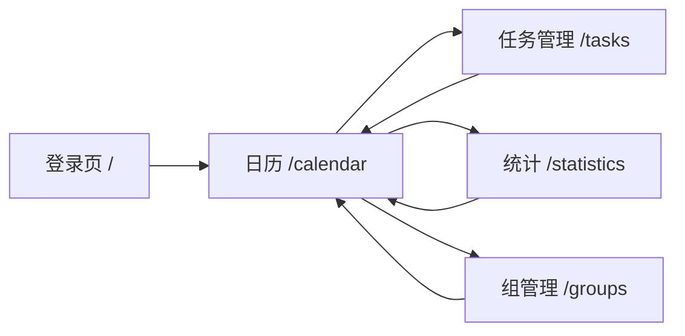

# 打卡日历 - 产品说明书

本文档基于工程中的关键逻辑整理，作为产品、开发与测试的统一参考。关键实现可对照代码路径查阅。

---

## 目录

1. [产品概述](#一产品概述)
2. [核心概念与数据模型](#二核心概念与数据模型)
3. [功能说明](#三功能说明)
4. [用户流程与页面结构](#四用户流程与页面结构)
5. [名词解释](#五名词解释)
6. [异常与边界](#六异常与边界)
7. [API 概览](#七api-概览)
8. [待实现与已知差异](#八待实现与已知差异)

---

## 一、产品概述

- **产品名称**：打卡日历
- **定位**：帮助用户培养习惯的 Web 应用，通过日历界面可视化任务与打卡记录。
- **目标用户**：希望用打卡方式养成习惯的个人用户，以及需要家庭/小组共享打卡的家庭或小团队。
- **核心价值**：
  - 个人任务管理（循环任务、一次性任务）
  - 多种周期类型（每日、每周、每月、自定义）
  - 一键打卡与取消打卡
  - 连续打卡激励与里程碑
  - 家庭/组共享日历与进度
  - 统计分析与可视化
- **技术形态**：前后端分离（Vite + React / Express + Prisma + SQLite），适合本地或内网部署。

---

## 二、核心概念与数据模型

数据模型定义见 `backend/prisma/schema.prisma`。

| 实体 | 说明 | 关键字段 |
|------|------|----------|
| **User** | 用户 | id, username（唯一）, avatar?, createdAt |
| **Task** | 任务 | 归属 user，可选归属 group；name, type（循环/一次性）, cycleType（每日/每周/每月/自定义）, cycleConfig(JSON), targetTime(HH:mm), color, startDate/endDate, status（进行中/已完成/已暂停） |
| **CheckIn** | 打卡记录 | taskId, userId, checkInDate（日期）, checkInDateTime（实际打卡时间） |
| **Group** | 组/家庭 | name, description?, inviteCode（唯一，8 位十六进制大写） |
| **GroupMember** | 组成员 | groupId, userId, role（创建者/成员） |

**关系要点**：

- 任务可属于个人（userId）或组（groupId）。
- 同一任务、同一用户、同一天仅允许一条打卡记录。
- 组通过邀请码加入；创建者自动成为组成员且 role 为「创建者」。

---

## 三、功能说明

### 3.1 用户与登录

**实现参考**：`backend/src/routes/users.ts`、`frontend/src/pages/Login.tsx`、`frontend/src/context/UserContext.tsx`

- **登录方式**：输入用户名；若用户不存在则自动注册并登录（当前无密码）。
- **会话**：前端通过 localStorage 存储用户信息，无服务端 Token 校验。
- **约束**：用户名必填、前后去空格、全局唯一。

### 3.2 任务管理

**实现参考**：`backend/src/routes/tasks.ts`、`frontend/src/pages/Tasks.tsx`、`backend/src/utils/calculations.ts`、`frontend/src/utils/calculations.ts`

- **能力**：创建、编辑、删除任务；列表按 userId（及可选 groupId）筛选。
- **任务类型**：循环 / 一次性。
- **周期类型与配置**：
  - **每日**：每天都需要打卡。
  - **每周**：`cycleConfig.daysOfWeek`（0–6，0=周日）。
  - **每月**：`cycleConfig.daysOfMonth`（1–31）。
  - **自定义**：`cycleConfig.interval` + `intervalUnit`（day/week），从任务 startDate 起算。
- **约束**：name、type、cycleType、targetTime 必填；targetTime 格式为 HH:mm；cycleConfig 以 JSON 存储。
- **表单**：任务新建/编辑表单支持可选「开始日期」「结束日期」；按周期类型展示 cycleConfig 配置：每周为星期几多选（0–6），每月为 1–31 日多选，自定义为间隔数 + 单位（天/周）。

### 3.3 打卡与连续天数

**实现参考**：`backend/src/routes/checkins.ts`、`backend/src/utils/streak.ts`

- **打卡规则**：同一 taskId + userId + checkInDate（按日归一化）仅允许一条记录；重复打卡返回「该日期已打卡」。
- **取消打卡**：删除对应 CheckIn 记录，并重新计算该任务该用户的连续天数与最长连续天数。
- **当前连续打卡天数**：以「最新打卡日为今天或昨天」为前提，从最新打卡日向前连续计数；否则为 0。
- **最长连续天数**：在所有打卡日期中，按日期排序后求最长连续区间（相邻日期相差 1 天）。
- **激励**：连续打卡 > 2 天时触发庆祝弹窗；里程碑为 3、7、14、30、60、100 天（见 `backend/src/utils/streak.ts` 中 `isMilestone`）。

### 3.4 日历展示与交互

**实现参考**：`frontend/src/components/calendar/CalendarGrid.tsx`、`frontend/src/components/calendar/TaskLabel.tsx`、`frontend/src/components/rewards/StreakCelebration.tsx`

- **数据**：按当前月拉取当前用户的 tasks 与 checkIns，按日组装「当日应打卡任务 + 是否已打卡」。
- **应打卡日**：由 `shouldCheckInOnDate(cycleType, cycleConfig, date, taskStartDate?, taskEndDate?)` 决定；若任务设置了开始/结束日期，则仅在该范围内显示应打卡日。
- **交互**：点击任务标签可打卡或取消打卡；打卡成功后若 streak > 2 则触发 StreakCelebration 弹窗。
- **展示**：每日最多展示 3 个任务标签，超出部分显示「+N 更多」。

### 3.5 组/家庭

**实现参考**：`backend/src/routes/groups.ts`、`frontend/src/pages/Groups.tsx`

- **创建组**：组名称必填；系统生成唯一 inviteCode（8 位十六进制大写）。
- **加入组**：需组 ID + 邀请码；邀请码统一转为大写后校验；已为成员时提示「您已经是该组的成员」。
- **组日历接口**：GET `/api/groups/:id/calendar` 返回组内任务、打卡记录及成员今日进度（今日打卡数/任务数）；可选查询参数 startDate、endDate 限定打卡日期范围。
- **组日历页面**：路由 `/groups/:id/calendar` 已配置，页面 [frontend/src/pages/GroupCalendar.tsx](frontend/src/pages/GroupCalendar.tsx) 复用 CalendarGrid（传入 groupId），「查看日历」可正常跳转并展示组内任务与打卡。

### 3.6 统计

**实现参考**：`backend/src/routes/statistics.ts`、`frontend/src/pages/Statistics.tsx`

- **用户维度**：总打卡次数、总任务数、进行中任务数；各任务的总打卡次数、当前连续、最长连续；24 小时打卡时间分布（timeDistribution）。
- **任务维度**：单任务总打卡、当前/最长连续、时间分布、最近 30 条打卡记录。
- **组维度**：组内总打卡、成员数、任务数；按成员统计打卡数并排序。
- **前端**：统计页主要展示用户维度（总览卡片、24 小时分布柱状图、任务完成饼图、任务详细表格）。

---

## 四、用户流程与页面结构

- **登录** `/`：输入用户名 → 登录/注册 → 跳转 `/calendar`。
- **日历** `/calendar`：月视图、按日展示任务与打卡状态、上/下月切换、导航到任务/统计/组、退出。
- **任务管理** `/tasks`：任务列表、新建/编辑/删除任务（表单含周期类型与目标时间）。
- **统计** `/statistics`：总览卡片、24 小时分布图、任务完成饼图、任务详细表格。
- **组** `/groups`：组列表、创建组、通过组 ID + 邀请码加入；「查看日历」跳转至 `/groups/:id/calendar` 组日历页。

---

## 五、名词解释

| 名词 | 说明 |
|------|------|
| **打卡日** | 用户对某任务在某自然日完成一次打卡，即该任务在该日有一条 CheckIn 记录；同任务同用户同一天仅能有一条打卡。 |
| **目标时间（targetTime）** | 任务期望的打卡时间，格式 HH:mm，用于展示与提醒参考，当前不强制在此时段内才能打卡。 |
| **连续打卡天数（当前连续）** | 从「今天或昨天」起向前连续有打卡的天数；若最新打卡早于昨天，则连续天数为 0。 |
| **最长连续天数** | 历史上该任务该用户所有打卡日期中，连续日期的最大长度（相邻相差 1 天）。 |
| **里程碑** | 连续打卡达到 3、7、14、30、60、100 天时触发的特殊激励展示。 |
| **邀请码** | 组的唯一 8 位十六进制大写字符串，用于加入组时校验；创建组时由系统生成。 |
| **周期类型** | 任务在哪些日期需要打卡：每日、每周（按星期几）、每月（按日）、自定义（按间隔）。 |
| **cycleConfig** | 周期配置的 JSON，如每周的 daysOfWeek、每月的 daysOfMonth、自定义的 interval 与 intervalUnit。 |

---

## 六、异常与边界

| 场景 | 行为或提示 |
|------|------------|
| 同一任务同一天重复打卡 | 接口返回「该日期已打卡」，不新增记录。 |
| 打卡时任务不存在 | 接口返回「任务不存在」（404）。 |
| 加入组时邀请码错误 | 接口返回「邀请码不正确」。 |
| 已是组成员再次加入 | 接口返回「您已经是该组的成员」。 |
| 用户名重复（注册） | 当前为「同名即登录」：同名用户视为登录，不新建用户。 |
| 无任务时的日历 | 日历正常展示月视图，各日无任务标签。 |
| 任务无 startDate/endDate | 周期判断不限制起止日期；自定义周期若未配置 startDate 可能无法正确计算应打卡日。 |
| 每周/每月/自定义未配置 cycleConfig | 根据实现，可能该日不会出现在应打卡日中（如每周未选任何一天则无应打卡日）。 |

---

## 七、API 概览

以下仅列出用途，具体请求/响应以代码为准。实现见 `backend/src/routes/` 与 `frontend/src/api/client.ts`。

| 用途 | 方法 | 路径（示例） |
|------|------|--------------|
| 登录/注册 | POST | /api/users |
| 获取用户信息 | GET | /api/users/:username |
| 获取任务列表 | GET | /api/tasks?userId=&groupId= |
| 创建任务 | POST | /api/tasks |
| 更新任务 | PUT | /api/tasks/:id |
| 删除任务 | DELETE | /api/tasks/:id |
| 获取打卡记录 | GET | /api/checkins?taskId=&userId=&dateRange= |
| 打卡 | POST | /api/checkins |
| 取消打卡 | DELETE | /api/checkins/:id |
| 用户统计 | GET | /api/statistics/user/:userId |
| 任务统计 | GET | /api/statistics/task/:taskId |
| 组统计 | GET | /api/statistics/group/:groupId |
| 获取组列表 | GET | /api/groups?userId= |
| 创建组 | POST | /api/groups |
| 获取组详情 | GET | /api/groups/:id |
| 加入组 | POST | /api/groups/:id/join |
| 组日历数据 | GET | /api/groups/:id/calendar?startDate=&endDate= |

---

## 八、待实现与已知差异

以下项已实现（与当前工程一致）：

- **组日历页面**：已配置路由 `/groups/:id/calendar`，并新增 [frontend/src/pages/GroupCalendar.tsx](frontend/src/pages/GroupCalendar.tsx)；[CalendarGrid](frontend/src/components/calendar/CalendarGrid.tsx) 支持可选 `groupId`，在组模式下通过 `getGroupCalendar` 拉取组内任务与打卡数据。「查看日历」可正常跳转并展示组日历。
- **任务 startDate/endDate**：任务管理表单已增加可选「开始日期」「结束日期」；日历在计算应打卡日时传入 `taskStartDate`、`taskEndDate` 至 `shouldCheckInOnDate`，按任务时间范围过滤。
- **周期配置 UI**：任务表单已按周期类型展示专用配置：**每周**为星期几多选（0–6），**每月**为 1–31 日多选，**自定义**为间隔数 + 单位（天/周）；切换周期类型时重置对应默认 cycleConfig，编辑时正确回填。

当前无其他待实现差异；若后续有新增功能或已知限制，请在此节补充。

---

*文档版本与工程实现保持一致，修改逻辑时请同步更新本说明书。*
